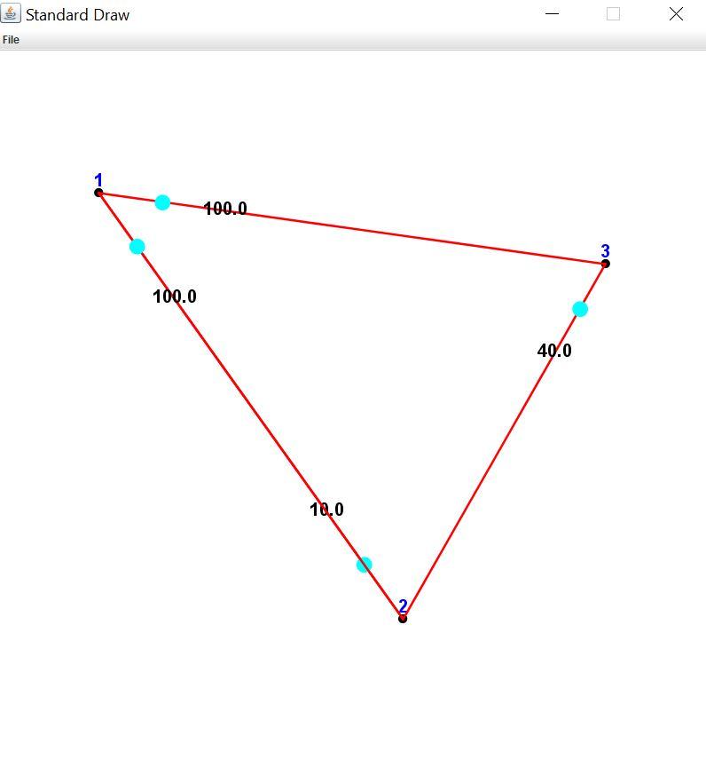

[](https://il.linkedin.com/in/gal-bar-576638173?trk=people-guest_profile-result-card_result-card_full-click)
[](https://www.linkedin.com/in/eden-reuveni/)


# The Maze of Waze:
    


#
#             About
```
This program represents undirected graph which composed of Vertices and Edges, and lets the user build his own graph and preform varies algorithams on it such as find the shorthest path,  is the graph connected and more!! 
```

#  DataStructure
The datastructure that the graph is composed of is 2 hashmaps: one for vartices and the other for edges 
```
Example for triangle graph:

 Vartices hashmap                     edges hashmap                       
|   key |  value  |                |  key |  key  |   value  | 
|-------|---------|                |------|-------|----------|
|   1   |    1    |                |   1  |   2   |    1 > 2 |
|   2   |    2    |                |   2  |   3   |    2 > 3 |
|   3   |    3    |                |   3  |   1   |    3 > 1 |
|-------|---------|                |------|-------|----------|


```

# Gui
```
The Gui part lets the user draw the graph and run complicated algorithams on it.
Example:
```

    


