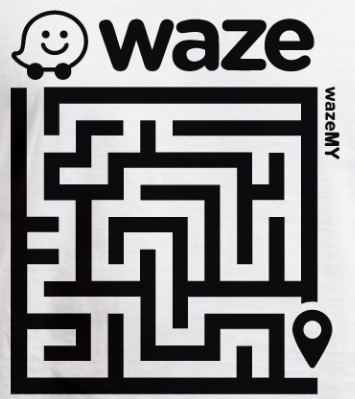

[](https://il.linkedin.com/in/gal-bar-576638173?trk=people-guest_profile-result-card_result-card_full-click)


# The Maze of Waze:
    


#
#             About

This program represent undirected graph which composed of Vertices and Edges, and let the user build his own graph and preform varies algorithams on his own graph such as find the shorthest path ,  is the graph connected and more!! 

```


